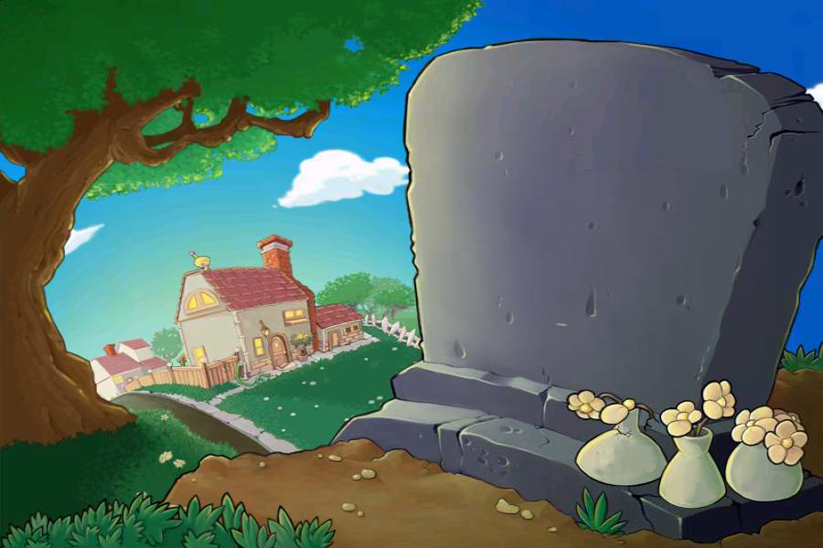

# 植物大战僵尸（Plants vs. Zombies）· C++ / EasyX 复刻版

一个使用 **C++** 与 **EasyX** 图形库从零实现的《植物大战僵尸》简化复刻版，运行于 Windows 平台。

项目采用「逐帧动画 + 双缓冲批量绘图」（`BeginBatchDraw` / `EndBatchDraw`）实现流畅渲染，包含 6 种植物、5 种僵尸、豌豆弹道与碰撞检测、阳光收集、三波僵尸进攻，以及完整的开场与结算过场动画。



---

## 游戏特性

### 植物（6 种）

| # | 名称 | 说明 |
| :-: | --- | --- |
| 1 | 豌豆射手 | 向所在行右侧发射豌豆 |
| 2 | 向日葵 | 周期性产出阳光，是阳光的主要来源 |
| 3 | 大嘴花 | 吞食靠近的僵尸，含「吞食 → 消化」两段逐帧动画 |
| 4 | 坚果墙 | 高血量阻挡物，随受损程度切换正常 / 轻度受损 / 严重受损三种动画 |
| 5 | 双发射手 | 一次连发两颗豌豆 |
| 6 | 三发射手 | 同时向相邻三行发射豌豆 |

### 僵尸（5 种）

| 名称 | 血量 | 说明 |
| --- | :-: | --- |
| 普通僵尸 | 150 | 基础单位 |
| 旗帜僵尸 | 150 | 每波开始时出现，初始位置比普通僵尸更靠前 |
| 路障僵尸 | 200 | 头顶路障 |
| 铁门僵尸 | 250 | 手持铁门 |
| 铁桶僵尸 | 300 | 头顶铁桶，最耐打 |

每种僵尸均具备 **静止 → 站立 → 行走 → 吃植物 → 死亡** 多套逐帧动画。

### 玩法机制

- **草坪网格**：3 行 × 9 列
- **阳光系统**：初始 150 点，点击掉落的阳光 +25；向日葵每隔约 200 帧产出一次阳光，并以抛物线飘落
- **种植方式**：点击卡片选中植物 → 拖动到目标格 → 松开种下
- **弹道系统**：豌豆根据目标行计算纵向速度，形成斜向弹道；最多 120 发同时在场
- **僵尸波次**：共 3 波，每波 10~20 只；波次越高特殊僵尸出现概率越高（30% → 55% → 80%）
- **胜负判定**：消灭全部僵尸即胜利，僵尸突破防线则失败，两者均有独立结算画面
- **过场动画**：开场镜头横移（混合展示各类僵尸站立动画）、植物卡片栏从上方缓缓下降
- **音效音乐**：通过 `winmm`（`mciSendString`）播放背景音乐与音效

## 操作说明

| 操作 | 效果 |
| --- | --- |
| 鼠标左键点击卡片栏 | 选中该植物 |
| 按住左键拖动 | 拖动植物预览到草坪 |
| 松开左键 | 在目标格种下植物 |
| 鼠标左键点击阳光 | 收集阳光 |

## 目录结构

```
Project1fw/
├── Project1fw.sln               # Visual Studio 解决方案
├── Project1fw/                  # 主工程目录
│   ├── Project1fw.vcxproj       # 工程文件（VS2022 / v143）
│   ├── main.cpp                 # 游戏主逻辑（约 1370 行）
│   ├── tools.cpp / tools.h      # 通用工具：putimagePNG 透明贴图、getDelay 计时
│   ├── vector2.cpp / vector2.h  # 二维向量运算，含 calcBezierPoint 三次贝塞尔插值
│   └── res/                     # 图片与音频资源
└── res/                         # 同一批资源的副本（历史遗留，未参与编译）
```

> 说明：根目录下的 `tools.cpp`、`vector2.cpp/h` 与 `res/` 是早期版本的副本；实际参与编译的是 `Project1fw/` 目录内的同名文件。

### res 资源目录

| 目录 | 内容 |
| --- | --- |
| `Plants/` | 各植物逐帧动画（Peashooter、SunFlower、WallNut、Chomper、Repeater、Threepeater 等） |
| `Zombies/` | 各僵尸逐帧动画（static / stand / walk / eat 四组） |
| `zhiwu/`、`zm/`、`zm_stand/`、`zm_eat/`、`zm_dead/` | 植物与僵尸的通用动画帧 |
| `Cards/` | 植物卡片贴图 |
| `bullets/` | 豌豆与命中特效 |
| `sunshine/` | 阳光动画帧（29 帧） |
| `Map/`、`Screen/` | 场景底图与界面素材 |
| `audio/` | 背景音乐与音效（mp3 / ogg） |
| `补充素材/` | 额外素材 |

## 编译与运行

### 环境要求

- Windows 10 / 11
- Visual Studio 2022（Platform Toolset **v143**）
- EasyX 图形库（提供 `graphics.h`）

### 步骤

1. 安装 EasyX 图形库（安装程序会自动匹配已安装的 Visual Studio 版本）
2. 用 Visual Studio 打开 `Project1fw.sln`
3. 选择 `x64` 平台配置
4. 按 `F5` 编译并运行

> **注意**：程序通过相对路径 `res/...` 加载资源，运行时工作目录需为 `Project1fw/` 目录。Visual Studio 默认的调试工作目录即为工程目录，通常无需修改；若提示找不到资源，请在「项目属性 → 调试 → 工作目录」中确认。

## 可调参数

`main.cpp` 顶部集中定义了主要可调参数，便于调整游戏平衡性：

| 宏 | 默认值 | 含义 |
| --- | :-: | --- |
| `width` / `height` | 900 / 600 | 游戏窗口尺寸 |
| `ZM_MAX_ACTIVE` | 30 | 同时存在的僵尸上限 |
| `ZM_WAVE_COUNT` | 3 | 僵尸总波数 |
| `BULLET_MAX` | 120 | 屏幕内子弹上限 |
| `ZM_SPECIAL_COUNT` | 4 | 特殊僵尸种类数 |
| `WALLNUT_DEAD_TIME` | 210 | 坚果墙被吃光所需计时 |

此外，僵尸血量、移动速度、每波数量、特殊僵尸出现概率等，均在对应函数处以注释标出「可调整」。

## 技术要点

- **双缓冲渲染**：每帧 `BeginBatchDraw` → 绘制 → `EndBatchDraw`，避免画面闪烁
- **逐帧动画**：以 `IMAGE` 数组按帧索引轮播，帧数不足时自动回绕
- **对象池**：子弹、阳光均使用固定长度数组 + `used` 标记复用，避免频繁内存分配
- **透明贴图**：`putimagePNG` 通过掩码实现 PNG 透明通道绘制
- **贝塞尔轨迹**：阳光飘落使用 `vector2::calcBezierPoint` 做三次贝塞尔插值，使运动更自然
- **多状态机**：僵尸在静止 / 站立 / 行走 / 吃 / 死亡之间按计时器切换状态

## 说明

本项目为个人学习与练习作品。游戏素材（图片、音频）来源于《植物大战僵尸》原作，仅供学习交流使用，请勿用于商业用途。
